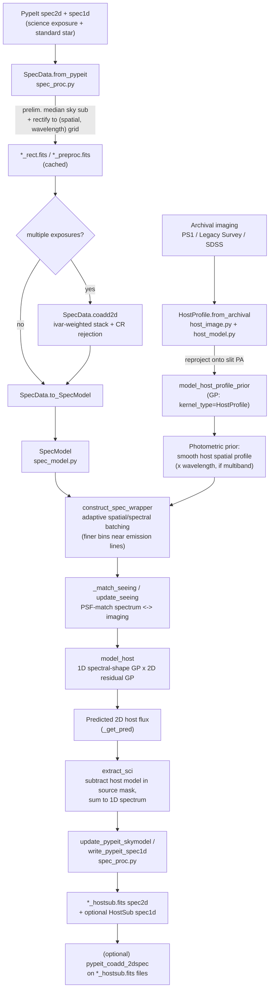
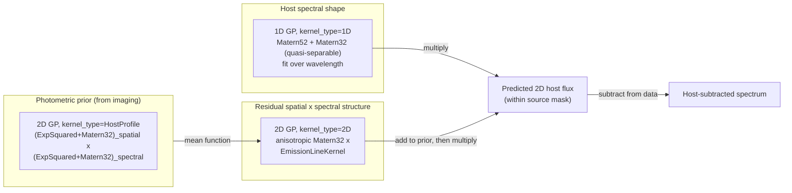
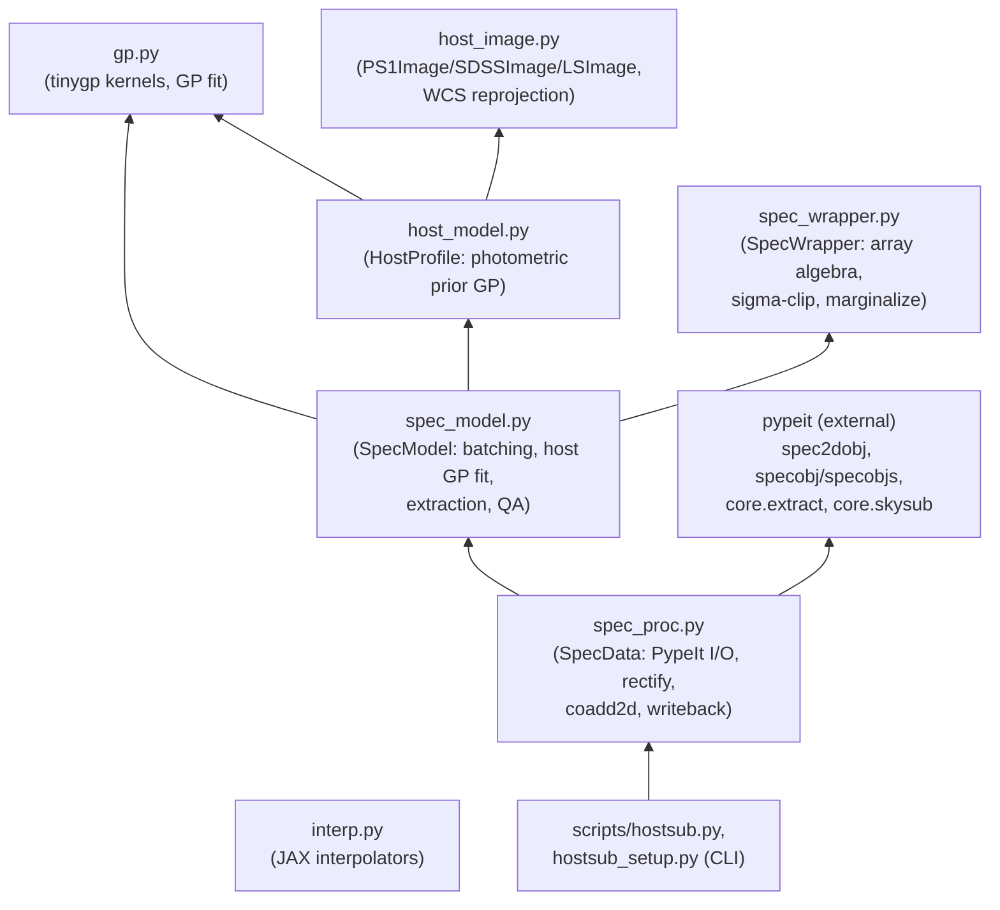

# HostSub_GP pipeline — visual summary

One-line version: HostSub_GP takes a PypeIt-reduced 2D long-slit spectrum
containing a transient superimposed on its host galaxy, builds a 2D
Gaussian-Process model of *just the host galaxy light* (informed by
archival broadband imaging), subtracts that model, and writes the result
back out as PypeIt-format `spec2d`/`spec1d` files.

Source: `src/hostsub_gp/`. CLI entry points: `hostsub_setup`, `hostsub`
(`src/hostsub_gp/scripts/`).

## 1. End-to-end data flow



## 2. The GP host model, zoomed in

This is the core science step (`model_host` in `spec_model.py` + `gp.py`).
Two GPs are fit and combined multiplicatively:



**Why three GPs and not one?** The photometric prior GP turns imaging into
a smooth spatial-profile prediction (space + optionally wavelength, but
imaging only has a few broad filters, so it can't capture spectral
structure at spectroscopic resolution). The 1D spectral GP supplies that
missing fine spectral structure (the host's overall spectral shape). The
2D residual GP mops up whatever's left — real spatial×spectral structure
in the data that neither the prior nor the 1D spectral shape predicted —
and is the one that needs the `EmissionLineKernel` so it doesn't smear
sharp emission lines.

## 3. Module dependency graph



Only `spec_proc.py` and `scripts/*` import PypeIt directly — everything
below that line (`gp.py`, `interp.py`, `spec_wrapper.py`, `host_image.py`,
`host_model.py`, `spec_model.py`) is PypeIt-agnostic. That boundary matters
a lot for the integration planning in
[../pypeit_integration_planning/](../pypeit_integration_planning/README.md):
it's the reason a deeper PypeIt integration is even plausible without a
rewrite.

## 4. Spatial regions on the slit

`SpecModel._build_spat_filter` (`spec_model.py`) partitions the rectified
2D spectrum, across the spatial (cross-slit) axis, into three regions that
recur throughout the code:

```
        spatial axis (arcsec from trace) →
   ─────────────────────────────────────────────
   |  sky   |   host    |  mask  |   host    | sky  |
   | region | (GP fit)  |(source)| (GP fit)  |region|
   ─────────────────────────────────────────────
                          ↑
                    transient trace
                 (e.g. FRB host galaxy
                  position on the slit)
```

- **`mask`**: the transient's own trace — never used to *fit* the host
  model, only to receive the *subtracted* prediction.
- **`host`**: region used to fit the GP host model (galaxy light without
  much transient contamination).
- **`sky`**: outermost region, used for the global/background sky level.

## 5. What actually changes in the output files

| PypeIt output | HostSub_GP does with it |
|---|---|
| `spec2d` (`Spec2DObj`) | Read: `sciimg`, `ivarraw`, `skymodel`, `waveimg`, `bpmmask`, `slits`. Write back: `skymodel` updated to include the GP host model, `*_hostsub.fits`. |
| `spec1d` (`SpecObj`/`SpecObjs`) | Read: trace geometry (`TRACE_SPAT`, `SLITID`, `DET`, `DETECTOR`) for the transient and/or standard star. Optionally write: a new `SpecObj` built from the HostSub extraction. |

See [../pypeit_integration_planning/README.md](../pypeit_integration_planning/README.md)
for how this file-level "read PypeIt output, write PypeIt-shaped output
back" approach compares to a deeper in-pipeline integration.

## Known rough edges to keep in mind while reading the code

(Full detail in `03_risks_open_questions.md` under the planning folder.)

- `host_model.py`: a kernel-type string typo (`"HostProfie"` vs
  `"HostProfile"`) breaks the single-filter photometric-prior fit path.
- `spec_proc.py`'s call into `pypeit.core.extract.fit_profile` doesn't
  match the current PypeIt checkout, where that function lives in
  `pypeit.core.spatialprofile` — likely version skew.
- `docs/reference/spectrographs.rst` is stale relative to `spec_proc.py`
  (FORS2 support exists in code but isn't documented).
